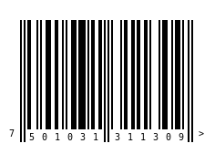
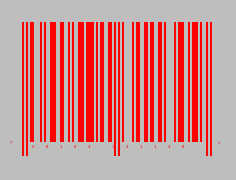
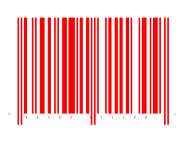
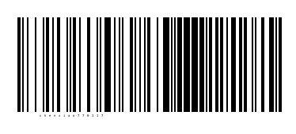

A Barcode reader and writer for Racket
==================

# Install
    raco pkg install simple-barcode

# Basic Usage
```racket

#lang racket

  (require simple-barcode)

  (barcode-write "750103131130" "barcode_ean13.png")

  (barcode-write "750103131130" "barcode_ean13_w5.png" #:brick_width 5)

  (barcode-write "750103131130" "barcode_ean13_color.png" #:color_pair '("red" . "gray"))

  (barcode-write "750103131130" "barcode_ean13_trans.png" #:color_pair '("red" . "transparent"))

  (printf "~a,~a,~a,~a\n"
    (barcode-read "barcode_ean13.png")
  
    (barcode-read "barcode_ean13_w5.png")
  
    (barcode-read "barcode_ean13_color.png")

    (barcode-read "barcode_ean13_trans.png"))

  (barcode-write "chenxiao770117" "barcode_code128.png" #:code_type 'code128)
  (printf "~a\n" (barcode-read "barcode_code128.png"))
  
```

default, brick_width = 2:<br>


brick_width = 5:<br>


change front and background color:<br>


set transparent background:<br>


7501031311309,7501031311309,7501031311309,7501031311309

code128, brick_width = 2:<br>


chenxiao770117


