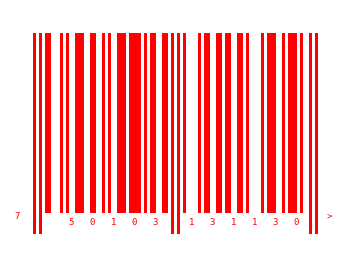
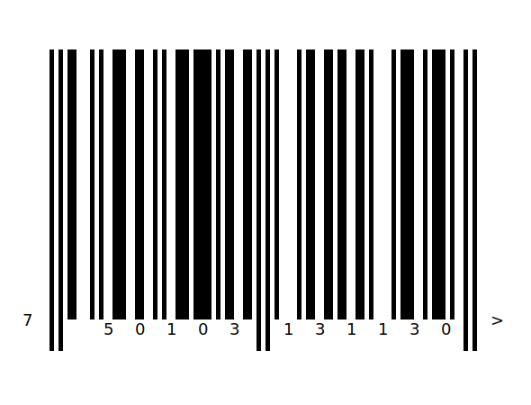
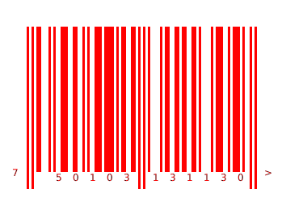

A Barcode reader and writer for Racket
==================

# Install
    raco pkg install simple-barcode

# Usage

## Write

select a type, size, color, then write a string to barcode.

```racket
(barcode-write
              [output_type (or/c 'png 'svg)]
              [code string?]
              [output_file_path path-string?]
              [#:code_type code_type symbol? 'ean13]
              [#:color_pair color_pair pair? '("black" . "white")]
              [#:brick_width brick_width natural? 3]
              [#:font_size font_size natural? 3])
            boolean?
```
support code_type: 'ean13, 'code128, 'code39, 'code39_checksum

## Read

read barcode from a picture file.

```racket
(barcode-read
             [barcode_file_path path-string?]
              [#:code_type code_type symbol? 'ean13]
              )
            string?
```
support code_type: 'ean13, 'code128, 'code39, 'code39_checksum

# Png Example
```racket
#lang racket

(require simple-barcode)

(barcode-write 'png "750103131130" "barcode_ean13.png")

(barcode-write 'png "750103131130" "barcode_ean13_w5.png" #:brick_width 5)

(barcode-write 'png "750103131130" "barcode_ean13_w10.png" #:brick_width 10 #:font_size 6)

(barcode-write 'png "750103131130" "barcode_ean13_color.png" #:color_pair '("red" . "gray"))
 
(barcode-write 'png "750103131130" "barcode_ean13_trans.png" #:color_pair '("red" . "transparent"))

(printf "~a,~a,~a,~a\n"
  (barcode-read "barcode_ean13.png")
  
  (barcode-read "barcode_ean13_w5.png")
  
  (barcode-read "barcode_ean13_color.png")

  (barcode-read "barcode_ean13_trans.png"))

(barcode-write 'png "chenxiao770117" "barcode_code128.png" #:code_type 'code128)
(printf "~a\n" (barcode-read "barcode_code128.png" #:code_type 'code128))

(barcode-write 'png "CHEN" "barcode_code39.png" #:code_type 'code39)
(printf "~a\n" (barcode-read "barcode_code39.png" #:code_type 'code39))

(barcode-write 'png "CHEN" "barcode_code39_checksum.png" #:code_type 'code39_checksum)
(printf "~a\n" (barcode-read "barcode_code39_checksum.png" #:code_type 'code39_checksum))
```

default, brick_width = 2:<br>


brick_width = 5:<br>


brick_width = 10, font_size=6:<br>


change front and background color:<br>


set transparent background:<br>


code128, brick_width = 2:<br>


code39, brick_width = 2:<br>


code39 add checksum, brick_width = 2:<br>


# Svg Example
```racket
#lang racket

(require simple-barcode)

(barcode-write 'svg "750103131130" "barcode_ean13.svg")

(barcode-write 'svg "750103131130" "barcode_ean13_w5.svg" #:brick_width 5)

(barcode-write 'svg "750103131130" "barcode_ean13_w10.svg" #:brick_width 10)

(barcode-write 'svg "750103131130" "barcode_ean13_color.svg" #:color_pair '("red" . "gray"))

(barcode-write 'svg "750103131130" "barcode_ean13_trans.svg" #:color_pair '("red" . "transparent"))

(barcode-write 'svg "chenxiao770117" "barcode_code128.svg" #:code_type 'code128)

(barcode-write 'svg "CHEN" "barcode_code39.svg" #:code_type 'code39)

(barcode-write 'svg "CHEN" "barcode_code39_checksum.svg" #:code_type 'code39_checksum)
```

default, brick_width = 2:<br>


brick_width = 5:<br>


brick_width:10<br>


change front and background color:<br>


set transparent background:<br>


code128, brick_width = 2:<br>


code39, brick_width = 2:<br>


code39 add checksum, brick_width = 2:<br>

